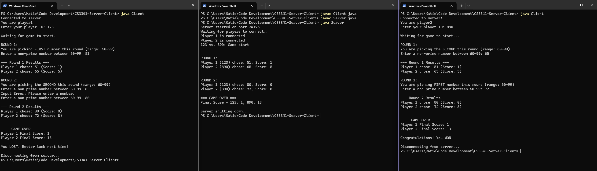

CS 3341 Fall 2025
Foundations of Modern Computing
---
# The HCF/LCM game
The game is a competition between two players. Each round player one will select a
number between 50 – 99 that is not prime. Then player two will pick a number between 60-
99 that is not prime. After the numbers are selected, the game is scored in the following
way:
- Player one’s score will be the highest common factor (HCF) of the two numbers
- Player two’s score will be the last digit of the lowest common multiple of the two
numbers (LCM).

Each game consists of two rounds where each player takes turns to be player one/two, and
the player with the higher cumulative score over the two rounds will be the winners (ties are allowed).

The following situation will lead to a player receiving 0 point for a round, and the opponent getting 100 point. (If both players make the same choices, both will get 0 point).
- The player picked a prime number
- The player picked a number outside the range 
- The player picked the same numbers in both rounds

### Note on Running/Testing
Due to the Nature of this program as a client-server program, testing in your
IDE is not realistic. You will need to clone the repo,  compile the client and server program , and then run each part seperately. I recommend using your favorite terminal/shell. I used WindowsPowerShell and `javac`/ `java` commands. Open 3 window of you terminal of choice. Have one first run the server then the next to run the players.

